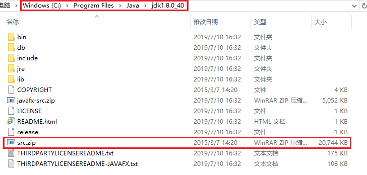

# JDK源码分析环境搭建
> `IDEA` 导入 `Oracle JDK` 源码

## JDK 和 JRE 介绍

### JDK
> JDK（Java Development Kit，Java 软件开发工具包，或称 Java 开发环境）是 Sun 公司针对 Java 开发人员发布的 SDK（Software development kit，免费软件开发工具包）。
Sun 公司于 2009 年被 Oracle 公司收购，因此目前 JDK 也称 Oracle JDK
### JRE
> JRE（Java Runtime Environment，Java 运行环境）是 Sun 公司研发的一个软件。
> 
> JRE 的内部有一个 Java 虚拟机（Java Virtual Machine，简称 JVM）以及一些标准的类库（Class Library），可以让计算机系统运行 Java 应用程序。
> 
> 普通用户并不需要安装 JDK 来运行 Java 程序，而只需要安装 JRE。而程序开发者必须安装 JDK 来编译、调试程序。

### OpenJDK
> OpenJDK 是 Sun 公司为 Java 平台构建的 Java 开发环境（JDK）的开源版本，以 GPL 协议的形式放发布。

##  源码简介

+ `com`：是 `sun` 的 `hotspot` 虚拟机中对 `java.*` 和 `javax.*` 的**实现类**。因为包含在 `rt` 中，所以我们也可以调用。但是因为不是 `sun` 对外公开承诺的接口，所以根据需要随时增减，因此在不同版本的 `hotspot` 中可能是不同的，而且在其他的 `jdk` 实现中是没有的，调用这些类，可能不会向后兼容，所以一般不推荐使用。
+ `java`：`java SE` 的标准库，是 `java` 标准的一部分，是对外承诺的 `java` 开发接口，通常要保持向后兼容，一般不会轻易修改。包括其他厂家的在内，所有 jdk 的实现，在 `java.*` 上都是一样的。
+ `javax`：也是 `java` 标准的一部分，但是没有包含在标准库中，一般**属于标准库的扩展**。通常属于某个特定领域，不是一般性的 `api` 。所以以扩展的方式提供 `api` ，以避免 `jdk` 的标准库过大。当然某些早期的 `javax`，后来被并入到标准库中，所有也应该属于新版本 `JDK` 的标准库。比如 `jmx`，`java 5` 以前是以扩展方式提供，但是 `jdk5` 以后就做为标准库的一部分了，所有 `javax.management` 也是 `jdk5` 的标准库的一部分。
+ `org`：是由企业或者组织提供的 `java` 类库，大部分不是 `sun` 公司提供的，同 `com`，不具备向后兼容性，会根据需要随时增减。其中比较常用的是 `w3c` 提供的对 XML、网页、服务器的类和接口。
+ `launcher`：是 `JRE` 中用于启动程序入口 `main()` 的类

## 环境搭建步骤
1. 在 JDK 的安装目录中，有一个名为 src.zip 的文件，此文件就是 JDK 的源码压缩文件
    
2. 解压 src.zip 文件
    
3. 用 IDEA 新建一个普通 Java 项目，并将解压文件导入到新建项目中
    
    
    
    

参考：[蓝星花：阅读jdk源码](https://blog.csdn.net/m0_37499059/article/details/79271593)

