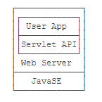
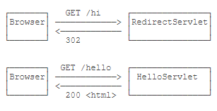
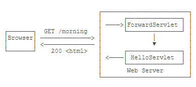
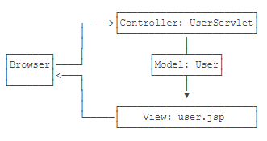
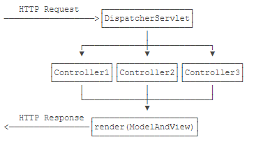

# Java Web 基础
> 本文将针对 Java Web 服务器端开发的一些基础知识做了解，不会对前端知识（HTML、CSS、JavaScript）做介绍

## JavaEE

> JavaEE（Java Platform Enterprise Edition，即 Java 企业平台）是完全基于 JavaSE，只是多了一大堆服务器相关的库以及 API 接口。
> 
> JavaEE 并不是一个软件产品，它更多的是一种软件架构和设计思想。可以将其看作是在 JavaSE 的基础上，开发的一系列基于服务器的组件、 API 标准和通用架构。
> 
> 所有的 JavaEE 程序，仍然是运行在标准的 JavaSE 的虚拟机上的。

JavaEE 最核心的组件就是基于 Servlet 标准的 Web 服务器，开发者编写的 Web 应用程序是基于 Servlet API 并运行在Web服务器内部的。



此外，JavaEE 还有一系列技术标准：

+ EJB：Enterprise JavaBean，企业级JavaBean，早期经常用于实现应用程序的业务逻辑，现在基本被轻量级框架如Spring所取代；
+ JAAS：Java Authentication and Authorization Service，一个标准的认证和授权服务，常用于企业内部，Web程序通常使用更轻量级的自定义认证；
+ JCA：JavaEE Connector Architecture，用于连接企业内部的EIS系统等；
+ JMS：Java Message Service，用于消息服务；
+ JTA：Java Transaction API，用于分布式事务；
+ JAX-WS：Java API for XML Web Services，用于构建基于XML的Web服务；
+ ......

## HTTP 协议

> HTTP 协议是一个基于 TCP 协议之上的请求-响应协议。

在 Web 应用中，浏览器请求一个 URL，服务器就把生成的 HTML 网页发送给浏览器，而浏览器和服务器之间的传输协议就是 HTTP。

对于浏览器来说，请求页面的流程如下：

1. 与服务器建立 TCP 连接；
2. 发送 HTTP 请求；
3. 接受 HTTP 响应，然后把网页在浏览器中显示出来。

**HTTP 请求** 和 **HTTP 响应** 都由 `HTTP Header` 和 `HTTP Body` 构成，其中 `HTTP Header` 每行都以 `\r\n` 结束。如果遇到两个连续的 `\r\n`，那么后面就是 `HTTP Body`。浏览器在接受 HTTP 响应时，会读取 `HTTP Body`，并根据 `HTTP Header` 中指示的 `Content-Type`、`Content-Encoding` 等信息解压后显示网页、图像或其他内容。

### HTTP 请求

举例：
```
GET / HTTP/1.1
Host: www.sina.com.cn
User-Agent: Mozilla/5.0 xxx
Accept: */*
Accept-Language: zh-CN,zh;q=0.9,en-US;q=0.8
```

说明：
1. 第一行表示使用 `GET` 请求获取路径为 `/` 的资源，并使用 `HTTP/1.1` 协议
2. 从第二行开始，每行都是以 `Header: Value` 形式表示的 HTTP Header，比较常用的 HTTP Header 包括：
    + `Host`: 表示请求的主机名，因为一个服务器上可能运行着多个网站，因此，`Host` 表示浏览器正在请求的域名；
    + `User-Agent`: 标识客户端本身，例如Chrome浏览器的标识类似 `Mozilla/5.0 ... Chrome/79`，IE浏览器的标识类似 `Mozilla/5.0 (Windows NT ...) like Gecko`；
    + `Accept`：表示浏览器能接收的资源类型，如 `text/*`，`image/*`或者`*/*`表示所有；
    + `Accept-Language`：表示浏览器偏好的语言，服务器可以据此返回不同语言的网页；
    + `Accept-Encoding`：表示浏览器可以支持的压缩类型，例如 `gzip`, `deflate`, `br`。


### HTTP 响应

举例：
```
HTTP/1.1 200 OK
Content-Type: text/html
Content-Length: 21932
Content-Encoding: gzip
Cache-Control: max-age=300

<html>...网页数据...
```

说明：
1. 第一行总是版本号+空格+数字+空格+文本，数字作为响应代码（其中2xx表示成功，3xx表示重定向，4xx表示客户端引发的错误，5xx表示服务器端引发的错误）给程序识别，文本则是给开发者调试使用的。常见的响应代码有：
    + `200 OK`：表示成功；
    + `301 Moved Permanently`：表示该URL已经永久重定向；
    + `302 Found`：表示该URL需要临时重定向；
    + `304 Not Modified`：表示该资源没有修改，客户端可以使用本地缓存的版本；
    + `400 Bad Request`：表示客户端发送了一个错误的请求，例如参数无效；
    + `401 Unauthorized`：表示客户端因为身份未验证而不允许访问该URL；
    + `403 Forbidden`：表示服务器因为权限问题拒绝了客户端的请求；
    + `404 Not Found`：表示客户端请求了一个不存在的资源；
    + `500 Internal Server Error`：表示服务器处理时内部出错，例如因为无法连接数据库；
    + `503 Service Unavailable`：表示服务器此刻暂时无法处理请求。
2. 从第二行开始，服务器每一行均返回一个 HTTP Header。服务器经常返回的 HTTP Header 包括：
    + `Content-Type`：表示该响应内容的类型，例如 `text/html`，`image/jpeg`；
    + `Content-Length`：表示该响应内容的长度（字节数）；
    + `Content-Encoding`：表示该响应压缩算法，例如 `gzip`；
    + `Cache-Control`：指示客户端应如何缓存，例如 `max-age=300` 表示可以最多缓存300秒。

### 搭建简易的 HTTP 服务器

> 编写一个基于多线程的 TCP 服务，实现一个简易的 HTTP 服务器


```java
public class Server {
    public static void main(String[] args) throws IOException {
        ServerSocket serverSocket = new ServerSocket(8080); // 端口监听
        System.out.println("server is running...");
        for (;;){
            final Socket socket = serverSocket.accept();
            System.out.println("connected from " + socket.getRemoteSocketAddress());
            Thread thread = new Handler(socket);
            thread.start();
        }
    }
}

class Handler extends Thread{
    Socket socket;

    public Handler(Socket socket){
        this.socket = socket;
    }

    public void run(){
        try (InputStream input = this.socket.getInputStream()){
            try(OutputStream output = this.socket.getOutputStream()){
                handle(input, output);
            }
        }catch (Exception e){
            try{
                this.socket.close();
            }catch (IOException ioe){

            }
            System.out.println("client disconnected.");
        }
    }

    // 用 Reader 读取 HTTP 请求，用 Writer 发送 HTTP 响应
    private void handle(InputStream input, OutputStream output) throws IOException {
        System.out.println("Process new http request...");
        BufferedReader reader = new BufferedReader(new InputStreamReader(input, StandardCharsets.UTF_8));
        BufferedWriter writer = new BufferedWriter(new OutputStreamWriter(output, StandardCharsets.UTF_8));
        // 处理请求
        boolean requestOk = false;
        String first = reader.readLine();
        System.out.println("\nHTTP Header:");
        System.out.println(first);
        if (first.startsWith("GET / HTTP/1.")) {
            requestOk = true;
        }
        for (;;) {
            String header = reader.readLine();
            if (header.isEmpty()) { // 读取到空行时, HTTP Header 读取完毕
                break;
            }
            System.out.println(header);
        }
        System.out.println();
        System.out.println(requestOk ? "Response OK" : "Response Error");
        if (!requestOk) {
            // 发送错误响应:
            writer.write("404 Not Found\r\n");
            writer.write("Content-Length: 0\r\n");
            writer.write("\r\n");
            writer.flush();
        } else {
            // 发送成功响应:
            String data = "<html><body><h1>Hello, world!</h1></body></html>";
            int length = data.getBytes(StandardCharsets.UTF_8).length;
            writer.write("HTTP/1.0 200 OK\r\n");
            writer.write("Connection: close\r\n");
            writer.write("Content-Type: text/html\r\n");
            writer.write("Content-Length: " + length + "\r\n");
            writer.write("\r\n"); // 空行标识Header和Body的分隔
            writer.write(data);
            writer.flush();
        }
    }
}
```


## Servlet

编写一个完善的 HTTP 服务器，以 HTTP/1.1 为例，需要考虑的包括：
+ 识别正确和错误的HTTP请求；
+ 识别正确和错误的HTTP头；
+ 复用TCP连接；
+ 复用线程；
+ IO异常处理；
+ ...

理想情况下，处理 TCP 连接，解析 HTTP 协议这些底层工作如果可以统统扔给现成的 Web 服务器去做，我们就只需要把自己的应用程序跑在 Web 服务器（如 `Tomcat`、`Jetty`）上。为了实现这一目的，JavaEE 提供了 `Servlet API` ，我们使用 `Servlet API` 编写自己的 `Servlet` 来处理 HTTP 请求，**Web 服务器实现 Servlet API 接口，实现底层功能**

### 简单的 Servlet 服务

1. 引入 `Servlet API` jar 包的依赖，并配置打包类型为 `war`（表示 Java Web Application Archive）
    ```xml
    <packaging>war</packaging>

    <dependencies>
        <!-- <scope>指定为provided，表示编译时使用，但不会打包到.war文件中，因为运行期Web服务器本身已经提供了Servlet API相关的jar包 -->
        <dependency>
            <groupId>javax.servlet</groupId>
            <artifactId>javax.servlet-api</artifactId>
            <version>4.0.0</version>
            <scope>provided</scope>
        </dependency>
    </dependencies>
    ```
2. 创建一个 [`web.xml` 描述文件](https://segmentfault.com/a/1190000011404088)，放到 `src/main/webapp/WEB-INF` 目录下（固定目录结构，不要修改路径，注意大小写）：
    ```xml
    <!DOCTYPE web-app PUBLIC
    "-//Sun Microsystems, Inc.//DTD Web Application 2.3//EN"
    "http://java.sun.com/dtd/web-app_2_3.dtd">
    <web-app>
    <display-name>Archetype Created Web Application</display-name>
    </web-app>
    ```
3. 新建一个 Servlet ，继承自 `HttpServlet`，覆写 `doGet()` 或 `doPost()` 等方法处理 HTTP 请求（`HttpServletRequest`）和 HTTP 响应（`HttpServletResponse`）
4. 配置 Tomcat 服务器，并启动项目；或者将编译后的 `.war` 文件复制到 Tomcat 的 `webapps` 目录下，然后切换到 `bin` 目录，执行 `startup.sh` 或 `startup.bat` 启动Tomcat服务器

**注意**：我们编写的 `Servlet` 并不是直接运行，而是由 Web 服务器加载后创建实例运行，所以，类似 Tomcat 这样的 Web 服务器也称为 **Servlet 容器**。在 Servlet 容器中运行的 Servlet 具有如下特点：
+ 无法在代码中直接通过 `new` 创建 `Servlet` 实例，必须**由 Servlet 容器自动创建** `Servlet` 实例；
+ Servlet 容器只会给每个 `Servlet` 类**创建唯一实例**；
+ Servlet 容器会使用**多线程**执行 `doGet()` 或 `doPost()` 方法。


### 内置 Tomcat 的 Servlet 服务

Tomcat 实际上也是一个 Java 程序，其启动流程如下：

1. 启动 JVM 并执行 Tomcat 的 `main()` 方法；
2. 加载 war 并初始化 Servlet；
3. 正常服务。

我们完全可以把 Tomcat 的 jar 包全部引入进来，然后自己编写一个 `main()` 方法，先启动 Tomcat，然后让它加载我们的 webapp 就行：

1. `<packaging>` 类型仍然为 `war` ，引入依赖 `tomcat-embed-core` 和 `tomcat-embed-jasper`（不必引入 `Servlet API` ，因为引入 Tomcat 依赖后自动引入了 `Servlet API`）
2. 创建 `web.xml` 和 自定义的 `Servlet`
3. 编写 `main()` 方法，启动 Tomcat 服务器
    ```java
    public class Main {
        public static void main(String[] args) throws Exception {
            // 启动 tomcat
            final Tomcat tomcat = new Tomcat();
            tomcat.setPort(Integer.getInteger("port", 8080));
            tomcat.getConnector();

            // 创建 webapp
            final Context context = tomcat.addWebapp("", new File("src/main/webapp").getAbsolutePath());
            final StandardRoot resources = new StandardRoot(context);
            resources.addPreResources(
                    new DirResourceSet(resources, "/WEB-INF/classes", new File("target/classes").getAbsolutePath(), "/")
            );
            context.setResources(resources);
            tomcat.start();
            tomcat.getServer().await();
        }
    }
    ```

通过 `main()` 方法启动 Tomcat 服务器并加载我们自己的 webapp 有如下好处：

+ **启动简单**，无需下载 Tomcat 或安装任何 IDE 插件；
+ **调试方便**，可在 IDE 中使用断点调试；
+ 使用 Maven 创建 war 包后，也可以**正常部署**到独立的 Tomcat 服务器中。

**问题：**

`IDEA` 中运行 `main()` 方法报错：`java.lang.NoClassDefFoundError: org/apache/catalina/WebResourceRoot`

**问题原因：**

`IDEA` 默认在运行时不会提供 `provided` 类型的依赖，所以 `scope` 设置为 `provided` 的两个依赖 `tomcat-embed-core` 和 `tomcat-embed-jasper` 没有引入

**解决方案：**

1. 打开 `IDEA` 的 `Run/Debug Configurations`
2. 选择 `Application` - `Main`
3. 右侧 `Configuration` - `Use classpath of module`
4. 钩上 `Include dependencies with "Provided" scope`

### Servlet 基础

> 一个 Web App 就是由一个或多个 Servlet 组成的，每个 Servlet 通过注解（`@WebServlet`）说明自己能处理的路径（早期的 Servlet 需要在 web.xml 中配置映射路径，但最新 Servlet 版本只需要通过注解就可以完成映射）

自定义的 `Servlet` 针对不同请求方法（如 GET、POST、PUT 等）的请求，需要覆写 `HttpServlet` 中对应的方法。如要处理 GET 请求，我们要覆写 `doGet()` 方法；要处理 POST 请求，我们要覆写 `doPost()` 方法；如果未覆写对应的方法，会直接返回 405 错误或 400 错误

根据 Servlet 配置的映射，不同的路径转发到不同的 Servlet（根据路径转发的功能我们一般称为 Dispatch），映射到 `/` 的 Servlet 比较特殊，它实际上会接收所有未匹配的路径，相当于 `/*`。

#### HttpServletRequest 和 HttpServletResponse
> `HttpServletRequest` 和 `HttpServletResponse` 这两个高级接口，使得我们不需要直接处理 HTTP 协议。具体的实现类是由各服务器提供的，而我们编写的 Web 应用程序只关心接口方法，并不需要关心具体的实现类。

+ `HttpServletRequest` 封装了一个 HTTP 请求
+ `HttpServletResponse` 封装了一个 HTTP 响应：由于 HTTP 响应必须先发送 Header ，再发送 Body，所以，操作 `HttpServletResponse` 对象时，必须先调用设置 Header 的方法，最后调用发送 Body 的方法；写入完毕后必须调用 `flush()`，因为大部分 Web 服务器都基于 HTTP/1.1 协议，会复用 TCP 连接。如果没有调用 `flush()`，将导致缓冲区的内容无法及时发送到客户端。此外，写入完毕后千万不要调用 `close()`，原因同样是因为会复用 TCP 连接，如果关闭写入流，将关闭 TCP 连接，使得 Web 服务器无法复用此 TCP 连接。


#### Servlet 多线程模型
> 一个 Servlet 类在服务器中只有一个实例，但对于每个 HTTP 请求，Web 服务器会使用多线程执行请求。因此，一个 Servlet 的 `doGet()`、`doPost()` 等处理请求的方法是**多线程并发执行**的。如果 Servlet 中定义了字段，要注意多线程并发访问的问题。
> 
> 对于每个请求，Web 服务器会创建唯一的 `HttpServletRequest` 和 `HttpServletResponse` 实例，因此，`HttpServletRequest` 和 `HttpServletResponse` 实例只有在当前处理线程中有效，它们总是局部变量，不存在多线程共享的问题。

#### 重定向
> 重定向（Redirect）是指当浏览器请求一个 URL 时，服务器返回一个重定向指令，告诉浏览器地址已经变了，麻烦使用新的 URL 再重新发送新请求。



+ 临时重定向，返回 302 响应，浏览器不会缓存 `/a` 到 `/b` 重定向的关联，每次请求 `/a` 时，浏览器都会先发送 `/a` 请求，收到服务器重定向指令后，再发送 `/b` 请求。响应内容为：
    ```
    HTTP/1.1 302
    Location: /b
    ```

+ 永久重定向，返回 301 响应，浏览器会**缓存** `/a` 到 `/b` 重定向的关联，下次请求 `/a` 时，浏览器直接发送 `/b` 请求。响应内容为：
    ```
    HTTP/1.1 301
    Location: /b
    ```

*Servlet 进行临时重定向：*
```java
@WebServlet(urlPatterns = "/a")
public class RedirectServlet extends HttpServlet {
    protected void doGet(HttpServletRequest req, HttpServletResponse resp) throws ServletException, IOException {
        // 构造重定向的路径:
        String redirectToUrl = "/b";
        // 发送重定向响应:
        resp.sendRedirect(redirectToUrl);
    }
}
```

*Servlet 进行永久重定向：*
```java
@WebServlet(urlPatterns = "/a")
public class RedirectServlet extends HttpServlet {
    protected void doGet(HttpServletRequest req, HttpServletResponse resp) throws ServletException, IOException {
        // 构造重定向的路径:
        String redirectToUrl = "/b";
        // 发送重定向响应:
        resp.setStatus(HttpServletResponse.SC_MOVED_PERMANENTLY); // 301
        resp.setHeader("Location", redirectToUrl);
    }
}
```

#### 转发

> 转发（Forward）是指内部转发。当一个 Servlet 处理请求的时候，它可以决定自己不继续处理，而是把请求和响应都转发给另一个 Servlet 处理。



*Servlet 进行转发：*
```java
@WebServlet(urlPatterns = "/a")
public class RedirectServlet extends HttpServlet {
    protected void doGet(HttpServletRequest req, HttpServletResponse resp) throws ServletException, IOException {
        req.getRequestDispatcher("/b").forward(req, resp);
    }
}
```

#### 转发和重定向的区别
+ 使用重定向时，浏览器知道重定向规则，并且会自动发起新的HTTP请求
+ 转发是在 Web 服务器内部完成的，浏览器并不知道服务器内部的转发逻辑，对浏览器来说，它只发出了一个 HTTP 请求


#### Servlet 使用 Cookie

*Servlet 设置 Cookie：*
```java
String lang = "username";
// 创建一个新的Cookie:
Cookie cookie = new Cookie("lang", lang);
// 设置Cookie生效的路径范围:
cookie.setPath("/");
// 设置Cookie有效期:
cookie.setMaxAge(8640000); // 8640000秒=100天
// 将该Cookie添加到响应:
resp.addCookie(cookie);
```

*Servlet 读取 Cookie：*
```java
private String parseLanguageFromCookie(HttpServletRequest req) {
    // 获取请求附带的所有Cookie:
    Cookie[] cookies = req.getCookies();
    // 如果获取到Cookie:
    if (cookies != null) {
        // 循环每个Cookie:
        for (Cookie cookie : cookies) {
            // 如果Cookie名称为lang:
            if (cookie.getName().equals("lang")) {
                // 返回Cookie的值:
                return cookie.getValue();
            }
        }
    }
    // 返回默认值:
    return "en";
}
```


#### Servlet 使用 Session

> Servlet 机制内建了对 Session 的支持，在 Servlet 程序中，总是通过 `HttpSession` 这个高级接口访问当前 Session。

*Servlet 设置 Session：*
```java
req.getSession().setAttribute("user", name);
```

*Servlet 读取 Session：*
```java
// 从HttpSession获取当前用户名:
String user = (String) req.getSession().getAttribute("user");
```

*Servlet 移除 Session：*
```java
/ 从HttpSession移除用户名:
req.getSession().removeAttribute("user")
```

Servlet 服务器识别 Session 的关键是依靠一个名为 `JSESSIONID` 的Cookie。在 Servlet 中第一次调用 `req.getSession()` 时，Servlet 容器会自动创建一个 Session ID，然后通过一个名为 `JSESSIONID` 的 Cookie 发送给浏览器；下次调用 `req.getSession()` 时，Servlet 容器会根据浏览器发送请求携带的 `JSESSIONID` 的 Cookie 找到对应的 `HttpSession`。

需要注意的是：
+ `JSESSIONID` 是由 **Servlet容器自动创建** 的，目的是维护一个浏览器会话，它和我们的登录逻辑没有关系；
+ 登录和登出的业务逻辑是我们自己根据 `HttpSession` 是否存在一个 `user` 的Key判断的，登出后，Session ID 并不会改变；
+ 即使没有登录功能，仍然可以使用 `HttpSession` 追踪用户，例如，放入一些用户配置信息等。

## JSP
> JSP（Java Server Pages）是一种文件类型，文件名必须以 `.jsp` 结尾，编写的文件必须放在 `/src/main/webapp` 目录下。
> 
> JSP 文件与 HTML 文件区别不大，JSP 文件中除了可以写 HTML 标签之外，还可以使用 JSP 特有指令 `<% ... %>` 去插入变量或实现动态输出。

**指令：**
+ `<%-- ... --%>` 是 JSP 的注释，它们会被完全忽略；
+ `<% ... %>` 中可以编写任意 Java 代码；
+ `<%= ... %>` 可以快捷输出一个变量的值；
+ `<%@ page import="java.io.*" %>` 可以引入 Java 类；
+ `<%@ include file="header.jsp"%>` 可以引入另一个 JSP 文件

**JSP 页面内置变量：**
+ `out`：表示 `HttpServletResponse` 的 `PrintWriter`；
+ `session`：表示当前 `HttpSession` 对象；
+ `request`：表示 `HttpServletRequest` 对象。

**访问 JSP 页面时，直接指定完整路径即可**：如 `src/main/webapp/hello.jsp`，则访问 `http://localhost:8080/hello.jsp` 即可（`contextPath` 为 `""`）

**JSP 原理**：JSP 在执行前会被编译成一个 Servlet，只不过不需要配置映射路径，Tomcat 会根据文件路径去找到对应的 `.jsp` 文件，找到后自动编译成 Servlet 再执行。在服务器运行过程中，如果修改了 `.jsp` 文件内容，服务器会自动重新编译。

## MVC
> `MVC`（Model-View-Controller）模式中，`Controller` 专注于业务处理，它的处理结果就是 `Model`。`Model` 可以是一个 JavaBean，也可以是一个包含多个对象的 Map，`Controller` 只负责把 `Model` 传递给 `View`，`View` 只负责把 `Model` 给“渲染”出来，这样，三者职责明确，且开发更简单，因为开发 `Controller` 时无需关注页面，开发 `View` 时无需关心如何创建 `Model`。

### 搭建简易的 MVC 模型

**Servlet 和 JSP 的特点**
+ Servlet 适合编写 Java 代码，实现各种复杂的业务逻辑，但不适合输出复杂的 HTML；
+ JSP 适合编写 HTML，并在其中插入动态内容，但不适合编写复杂的 Java 代码。

可以将两者结合起来，发挥各自的优点，避免各自的缺点，**通过 Servlet 和 JSP 实现了一个简单的MVC模型**



Servlet 接受到请求之后，进行相关业务逻辑操作（从数据库里读取信息等），将操作后的结果（Model）通过 `req.setAttribute()` 方法放在 `HttpServletRequest` 中，最后通过 **转发** 机制将 `Model` 转发到 JSP 文件中处理。

关键代码：
```java
// 放入Request中:
req.setAttribute("user", user);
// 转发给 user.jsp
// 把user.jsp放到/WEB-INF/目录下，是因为WEB-INF是一个特殊目录
// Web Server会阻止浏览器对WEB-INF目录下任何资源的访问，这样就防止用户通过/user.jsp路径直接访问到JSP页面；
req.getRequestDispatcher("/WEB-INF/user.jsp").forward(req, resp);
```

### 搭建一个完整的 MVC 框架

**直接把 MVC 搭在 Servlet 和 JSP 之上还是不太好**：
+ Servlet 提供的接口仍然偏底层，需要实现 Servlet 调用相关接口 -- 接口封装；
+ JSP 对页面开发不友好，更好的替代品是模板引擎；
+ 业务逻辑最好由纯粹的 Java 类实现，而不是强迫继承自 Servlet -- 反射机制。

**MVC 框架的设计**
+ ModelAndView：包含一个 `View` 和一个 `Model`。其中 `View` 代表模板的路径（`String`），`Model` 表示要传递的数据（`Map<String, Object>`）
+ DispatcherServlet：一个接收所有请求（映射到 `/`）的 `Servlet`，作为具体请求到具体方法的调度员。该 `Servlet` 会根据不同的 `Controller` 的方法定义的 `@Get` 或 `@Post` 的 `Path` 决定调用哪个方法，最后，获得方法返回的 `ModelAndView` 后，渲染模板，写入 `HttpServletResponse`，即完成了整个MVC的处理




## Cookie、Session 和 Token

### Cookie

> Cookie 的根本作用就是在浏览器客户端存储用户访问网站的一些信息

#### Cookie 的工作原理

1. 创建 Cookie（服务器端）：
   + 创建一个 Cookie 对象
   + 设置 Cookie 的名称和值
   + 设置 Cookie 的最大时效（`maxAge`，以秒为单位的时间）。如果没有设置最大时效，Cookie 默认是一个会话级别，即存储在浏览器的内存中，用户退出浏览器之后 Cookie 就被删除；如果网站希望浏览器将该 Cookie 存储在磁盘上，则需要设置最大时效；如果将最大时效设为 0 则是命令浏览器删除该Cookie
   + 设置 Cookie 生效的路径范围（`Path`，字符串）。作为后续浏览器发送请求是否携带 Cookie 时的判断条件（URL 前缀是设置 Cookie 时的 `Path`）
   + 如果访问的是 HTTPS 网页，还需要调用 `setSecure(true)`，否则浏览器不会发送该 Cookie
   + 将 Cookie 放入到一个名为 `Set-Cookie` 的 HTTP 响应报头中
   + 发送 HTTP 响应报文
2. 存储 Cookie（浏览器端）：浏览器收到响应报文之后，根据报文头里的 `Set-Cookie`，生成相应的Cookie，保存在浏览器端
3. 发送 Cookie（浏览器端）：当用户再次访问网站时，浏览器首先检查所有存储的 Cookies ，如果某个存在该网站且满足携带条件的 Cookie，则把该 Cookie 附在请求资源的 HTTP 请求头上发送给服务器
4. 读取 Cookie（服务器端）：服务器接收到用户的 HTTP 请求报文之后，从报文头获取到该用户的 Cookie，从里面找到所需要的东西（或者重新设置 Cookie）


#### Cookie 的携带条件
浏览器在请求某个 URL 时，是否携带指定的 Cookie，取决于 Cookie 是否满足以下所有要求：

+ URL 前缀是设置 Cookie 时的 `Path`；
+ Cookie 在有效期内；
+ Cookie 设置了 `secure` 时必须以 https 访问。

#### Cookie 的缺点

+ Cookie 会被附加在每个 HTTP 请求中，无形中**增加了流量**。
+ 由于在 HTTP 请求中的 Cookie 是**明文传递**的，所以安全性成问题（除非用 `HTTPS`）。
+ Cookie 的大小限制在 `4KB` 左右，**无法应对复杂的存储需求**。

### Session

> 因为 HTTP 协议是一个无状态协议，即 Web 应用程序无法区分收到的两个 HTTP 请求是否是同一个浏览器发出的。为了**跟踪用户状态**，服务器可以向浏览器分配一个唯一 ID ，并以 Cookie 的形式发送到浏览器，浏览器在后续访问时总是附带此 Cookie，这样，服务器就可以识别用户身份。这种**基于唯一 ID 识别用户身份的机制**称为 Session。
> 
> Session 代表服务器与浏览器的一次会话过程，是一种服务器端的机制。Session （对象）由服务端生成，用来存储特定用户会话所需的信息，保存在服务器的内存、缓存、硬盘或数据库中。

除了使用 **Cookie 机制**可以实现 Session 外，还可以通过**隐藏表单**、**URL 末尾附加 ID（URL 重写）** 来追踪 Session。这些机制很少使用，最常用的 Session 机制仍然是 Cookie。

#### Session 的适用场景

使用 Session 机制，会使得 Web Server 的集群很难扩展，因此，Session 适**用于中小型 Web 应用程序**。对于大型 Web 应用程序来说，通常需要避免使用 Session 机制。

### Token
