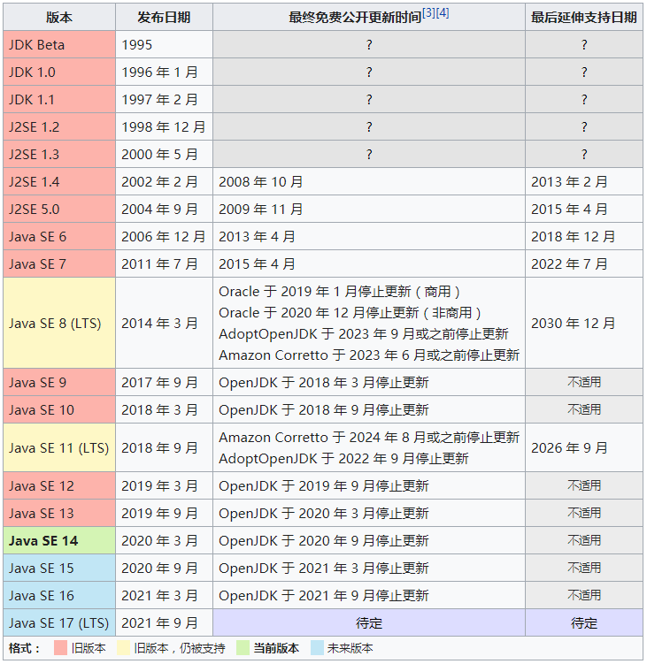
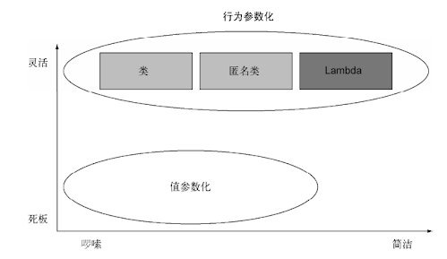

# Java8实战-读书笔记

## 第零部分 相关资源
[书中实例代码](https://github.com/java8/Java8InAction)

### 1、重要概念
+ 事件处理器
+ 回调函数

## 第一部分 基础知识

> 目的：对 Lambda 表达式有充分的了解，编写更加简洁和灵活的代码。

## 第1章 为什么要关心 Java 8

> 总结 Java 8 的主要变化：Lambda 表达式、方法引用、流和默认方法。

[Java 版本--摘自 wiki](https://zh.wikipedia.org/wiki/Java%E7%89%88%E6%9C%AC%E6%AD%B7%E5%8F%B2)

在众多的版本更新中，Java 8 版本无疑是影响最深远的一个。它增加的新特性不仅让开发人员可以编写成更为简洁和清晰的代码，而且其对硬件也有影响（能够更简单地使用多核处理器）。

+ Strean API：支持数据处理的并行操作
+ 用行为参数化把代码传递给方法（Lambda、方法引用）：当写了两个只有几行代码不同的方法时，可以把不同的那部分代码作为参数传递进入即可

### 1.1 Java 怎么还在变

> 语言需要不断改进以跟进硬件的更新或满足程序员的期待，Java必须通过增加能够被人使用的新功能来改进，使得Java在整个编程语言生态系统中占据重要位置。

**3个概念**：
+ 流处理：类似与 Unix 命令行允许多个命令程序通过管道连接在一起
+ 用行为参数化把代码传递给方法：让**做什么**和**怎么做**区分开来
+ 并行和共享的可变数据：并行只有在假定你的代码的多个副本可以独立工作（即没有共享的可变数据）时才能进行

### 1.2 Java 中的函数

> 编程语言中的**函数**通常是指**方法**

在 Java（或其他面向对象）编程语言中，由于存在对象，所以会出现静态方法和实例（对象）方法

Java 中常见概念有：值（原始类型值、引用类型值）、方法、类等。在 Java 8 之前，值为一等公民（在程序执行期间可以传递的），而方法和类等则是二等公民（在程序执行期间不能传递）。Java 8 中的新特性（方法引用、Lambda）则将 Java 中的方法由二等公民变成了一等公民（*或者也可以说，将方法作为值*）。

与用对象引用（new 创建）传递对象类似，方法引用（如 File::isHidden）可以传递方法。使用方法引用时，需要预先知道类名和方法名，在不清楚这些条件或者方法内代码长度短的情况下，可以使用 Lambda（匿名函数）替代。 

### 1.3 流

+ 外部迭代：使用集合（Collection API）时，自己用for（或 for-each）循环迭代元素再处理元素；
+ 内部迭代：有了流（Stream API），数据迭代和处理都在库内部进行；

Java 8 使用流解决了两个问题：集合处理时的套路和晦涩，以及难以利用多核。在学习了 Java 8 之后，可以结合 Collection 和 Stream 处理集合，其中 Collection 主要用于存储和访问数据，Stream 用于描述对数据的计算（处理数据）。

### 1.4 默认方法

> 默认方法（default 关键字）的加入主要是为了支持库设计师，让他们能够写出更容易改进的接口。

问题：在 Java 8 之前，可能会更新一个接口（新增了一个接口方法），然后发现把所有实现它的类也给更新了（实现的类必须为其提供一个实现，这必然修改工作非常重大），这会导致严重问题，是一个逻辑灾难？

解决：Java 8 提供的默认方法，可以让实现类不是必须实现所有的接口方法。这位接口设计者提供了一个扩充接口的方式，而不会破坏现有的代码。

新的问题：一个类可以实现多个接口，如果其中多个接口都有默认实现，意味着 Java 中有了某种形式的多重继承

### 1.5 来自函数式编程的其他好思想

+ Optional<T> 类如何避免出现**空指针**异常：该类中有方法来明确处理值不存在的情况
+ 模式匹配：不懂？？

## 第2章 通过行为参数化传递代码

> 了解行为参数化（一种软件开发模式）

### 1、为什么需要行为参数化

> 应对不断变化的需求，将**做什么**和**怎么做**区分开，也意味着某个方法可以接受不同的行为作为参数然后去执行

### 2、行为参数化的概念

行为参数化 != 函数作为值传递给方法

### 3、行为参数化在 Java 中的演变

0. 一般方式（建多个方法）
   + 无法应对复杂查询，当有新的需求时，需要新添加一个方法，而且代码（迭代行为）重复
1. 策略设计模式（多态）
   + 优点：去除了迭代代码的重复，也将做什么和怎么做区分开了，便于扩展新需求
   + 缺点：每次添加一个新需求，都需要新建一个类，代码还是很臃肿 == 声明了很多只需要实例化一次的类
2. 匿名类（去除实现类的声明，可以当用户在使用方法的同时直接声明和实例化一个类）
   + 优点：代码更加简洁了
   + 缺点：代码还是包含许多模板代码，而且代码还不够语义化
   + 注意：匿名类中的 this 指向匿名类当前实例
3. Lambda
   + 优秀

## 第3章

> 全面解释 Lambda 表达式和方法引用

#### 

## 第二部分 函数式数据处理 
## 第三部分 高效 Java 8 编程
## 第四部分 超越 Java 8 

