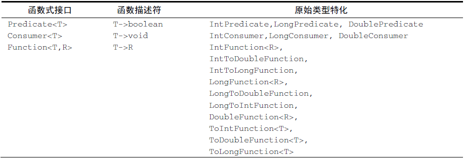
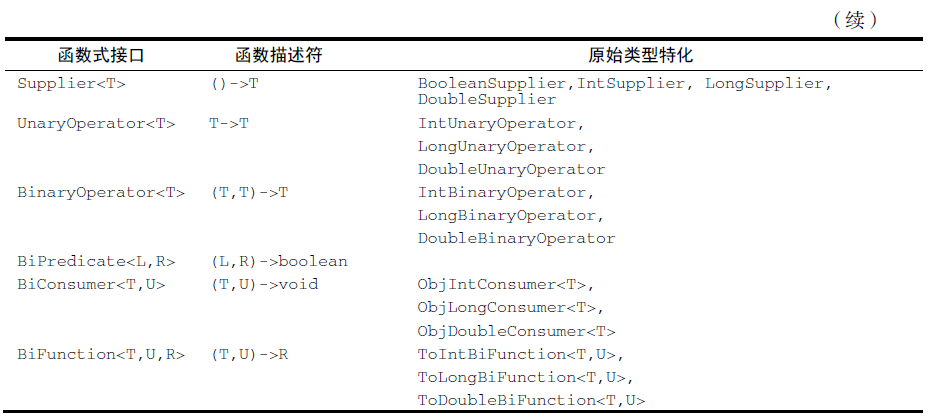
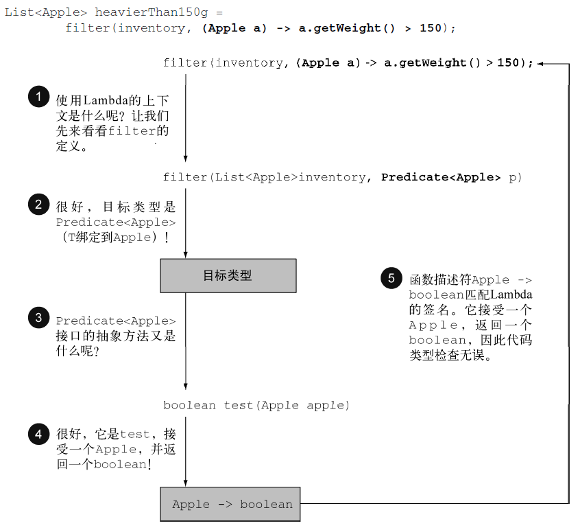
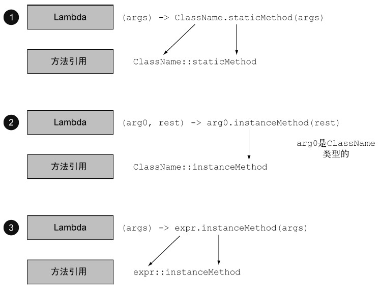
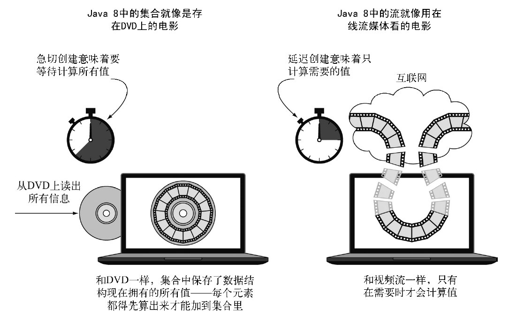
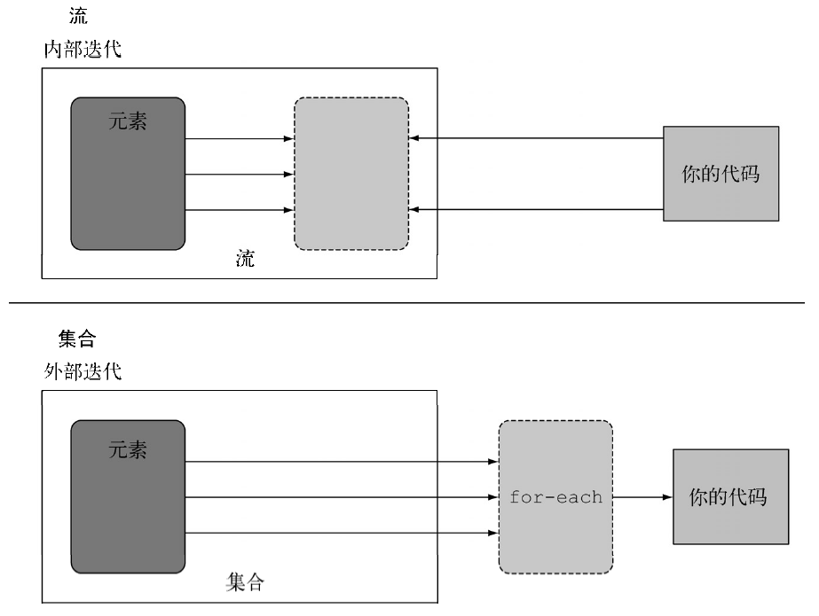
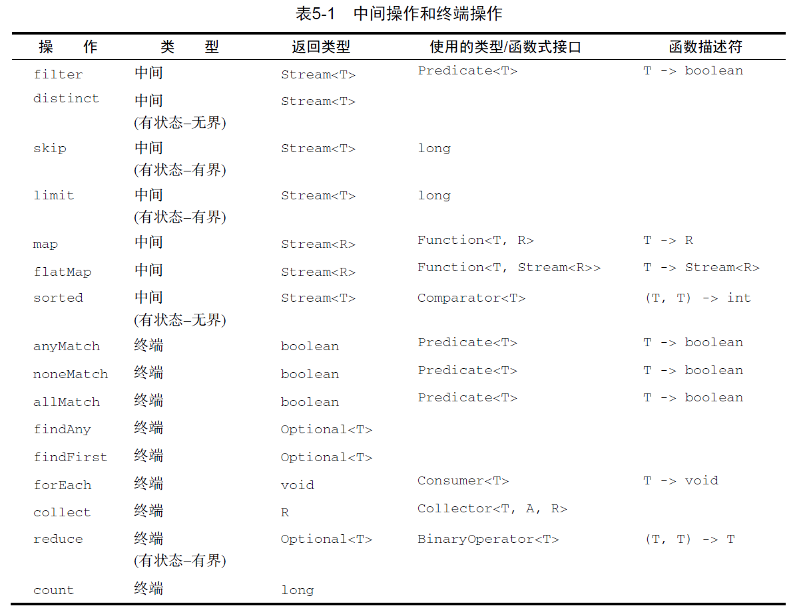

# Java8实战-读书笔记

## 第零部分 相关资源
[书中实例代码](https://github.com/java8/Java8InAction)

### 1、重要概念
+ 事件处理器
+ 回调函数

## 第一部分 基础知识

> 目的：对 Lambda 表达式有充分的了解，编写更加简洁和灵活的代码。

## 第1章 为什么要关心 Java 8

> 总结 Java 8 的主要变化：Lambda 表达式、方法引用、流和默认方法。

[Java 版本--摘自 wiki](https://zh.wikipedia.org/wiki/Java%E7%89%88%E6%9C%AC%E6%AD%B7%E5%8F%B2)


在众多的版本更新中，Java 8 版本无疑是影响最深远的一个。它增加的新特性不仅让开发人员可以编写成更为简洁和清晰的代码，而且其对硬件也有影响（能够更简单地使用多核处理器）。

+ Strean API：支持数据处理的并行操作
+ 用行为参数化把代码传递给方法（Lambda、方法引用）：当写了两个只有几行代码不同的方法时，可以把不同的那部分代码作为参数传递进入即可

### 1.1 Java 怎么还在变

> 语言需要不断改进以跟进硬件的更新或满足程序员的期待，Java必须通过增加能够被人使用的新功能来改进，使得Java在整个编程语言生态系统中占据重要位置。

**3个概念**：
+ 流处理：类似与 Unix 命令行允许多个命令程序通过管道连接在一起
+ 用行为参数化把代码传递给方法：让**做什么**和**怎么做**区分开来
+ 并行和共享的可变数据：并行只有在假定你的代码的多个副本可以独立工作（即没有共享的可变数据）时才能进行

### 1.2 Java 中的函数

> 编程语言中的**函数**通常是指**方法**

在 Java（或其他面向对象）编程语言中，由于存在对象，所以会出现静态方法和实例（对象）方法

Java 中常见概念有：值（原始类型值、引用类型值）、方法、类等。在 Java 8 之前，值为一等公民（在程序执行期间可以传递的），而方法和类等则是二等公民（在程序执行期间不能传递）。Java 8 中的新特性（方法引用、Lambda）则将 Java 中的方法由二等公民变成了一等公民（*或者也可以说，将方法作为值*）。

与用对象引用（new 创建）传递对象类似，方法引用（如 File::isHidden）可以传递方法。使用方法引用时，需要预先知道类名和方法名，在不清楚这些条件或者方法内代码长度短的情况下，可以使用 Lambda（匿名函数）替代。 

### 1.3 流

+ 外部迭代：使用集合（Collection API）时，自己用for（或 for-each）循环迭代元素再处理元素；
+ 内部迭代：有了流（Stream API），数据迭代和处理都在库内部进行；

Java 8 使用流解决了两个问题：集合处理时的套路和晦涩，以及难以利用多核。在学习了 Java 8 之后，可以结合 Collection 和 Stream 处理集合，其中 Collection 主要用于存储和访问数据，Stream 用于描述对数据的计算（处理数据）。

### 1.4 默认方法

> 默认方法（default 关键字）的加入主要是为了支持库设计师，让他们能够写出更容易改进的接口。

问题：在 Java 8 之前，可能会更新一个接口（如，给接口新增了一个方法），然后发现需所有实现它的类也必须要更新（实现的类必须为其提供一个实现，这必然修改工作非常重大），这会导致严重问题，是一个逻辑灾难。

解决：Java 8 提供的默认方法，可以让实现类不是必须实现所有的接口方法。这为接口设计者提供了一个扩充接口的方式，而不会破坏现有的代码。

新的问题：一个类可以实现多个接口，如果其中多个接口都有默认实现，意味着 Java 中有了某种形式的多重继承，怎么解决？？？

### 1.5 来自函数式编程的其他好思想

+ Optional<T> 类如何避免出现**空指针**异常：该类中有方法来明确处理值不存在的情况
+ 模式匹配：不懂？？


## 第2章 通过行为参数化传递代码

> 了解行为参数化（一种软件开发模式）

### 1、为什么需要行为参数化

> 应对不断变化的需求，将**做什么**和**怎么做**区分开，也意味着某个方法可以接受不同的行为作为参数然后去执行

### 2、行为参数化的概念

> 行为参数化 != 将方法作为值传递给方法
> 
> Java 8 之前可以通过多态或匿名类实现行为参数化

### 3、行为参数化在 Java 中的演变


0. 一般方式（建多个方法）
   + 无法应对复杂查询，当有新的需求时，需要新添加一个方法，而且代码（迭代行为）重复
1. 策略设计模式（多态）
   + 优点：去除了迭代代码的重复，也将做什么和怎么做区分开了，便于扩展新需求
   + 缺点：每次添加一个新需求，都需要新建一个类，代码还是很臃肿 == 声明了很多只需要实例化一次的类
2. 匿名类（去除实现类的声明，可以当用户在使用方法的同时直接声明和实例化一个类）
   + 优点：代码更加简洁了
   + 缺点：代码还是包含许多模板代码，而且代码还不够语义化
   + 注意：匿名类中的 this 指向匿名类当前实例
3. Lambda
   + 优秀


## 第3章 Lambda 表达式

> 全面解释 Lambda 表达式和方法引用

### 1、如何构建 Lambda 表达式
> 可以把 Lambda 表达式可以理解为简洁表示可传递的匿名函数的一种方法：没有名称，有参数列表、函数主体、返回类型，可能还有一个可以抛出的异常列表。

#### 1.1 Lambda 表达式的特点
+ 匿名：Lambda 不像普通方法那样有一个明确的名称
+ 函数：Lambda 函数不像方法那样属于某个特定的类，但和方法一样，有参数列表、函数主体、返回类型，还可能有可以抛出的异常泪飙
+ 传递：Lambda 表达式可以作为参数传递给方法或存储在变量中
+ 简洁：无需像匿名类那样写很多模板代码

#### 1.2 Lambda 表达式的三个部分
+ 参数列表
+ 箭头：箭头 `->` 把参数列表和 Lambda 主体分隔开
+ Lambda 主体：可以是一个表达式（会隐含 `return` 语句，表达式的值同时也将作为返回值），也可以是一个代码块（此时，如果要返回值，必须通过 `return` 语句显式表示）

```
(parameters) -> expression
(parameters) -> {statements;}
```

### 2、Lambda 表达式的使用场合

> Lambda 表达式只可以使用在函数式接口上

#### 2.1 函数式接口

> 函数式接口就是只定义一个抽象方法的接口，一般会为该接口添加 `@FunctionalInterface` 注解（推荐但不是必需的）

在有个函数式接口之后，Lambda 表达式允许直接以内联的形式为函数式接口的抽象方法提供实现，并把整个表达式作为函数式接口的实例（具体来说，是函数式接口的一个具体实现的实例）。

#### 2.2 函数描述符

> 函数式接口的抽象方法的签名基本上就是 Lambda 表达式的签名，我们可以把这种签名叫做函数描述符。

可以使用一种特殊表示法来记录函数描述符：`(parameterTypeList) -> returnType`，举例如下：
+ `() -> void`：什么也不接受什么也不返回（void）的函数
+ `(Apple, Apple) -> int`：接受两个Apple为参数并返回int的函数

### 3、如何使用 Lambda

#### 3.1 自定义函数式接口

1. 行为参数化：查看现有方法，提取现有方法中代码不同的部分，并总结该部分代码的输入和输出
2. 定义函数式接口：定义函数式接口及其抽象方法，输入作为抽象方法的参数列表，输出作为抽象方法的返回值
3. 执行行为：使用函数式接口作为现有方法的新增参数，并将抽象方法的调用替换提取的部分代码，从而重构现有方法
4. 传递行为（Lambda）：使用 Lambda 表达式调用重构的方法来执行代码

#### 3.2 使用 Java API 提供的函数式接口

常用函数式接口：
+ `Predicate<T>`（test）：`(T) -> boolean`
+ `Consumer<T>`（accept）：`(T) -> void`
+ `Function<T,R>`（apply）：`(T) -> R`




### 4、Lambda 表达式中的细节

#### 4.1 类型检查

> Lambda 表达式本身并不包含它在实现哪个函数式接口的信息，其实际类型（或称目标类型）是从使用 Lambda 的上下文推断出来的。
> 
> 同一个 Lambda 表达式可以与不同的函数式接口联系起来，其具体类型需要根据上下文推断。

Lambda 表达式的类型检查过程如下：



注意：如果 Lambda 表达式抛出一个异常，那么抽象方法所声明的 throw 语句也必须与之匹配。

#### 4.2 特殊的 void 兼容规则

> 如果一个 Lambda 的主体是一个语句表达式，它就和一个返回 void 的函数描述符兼容。

```Java
// 尽管 List 的 add 方法返回一个 boolean
Consumer<String> consumer = s -> list.add(s);
```

#### 4.3 类型推断

> Java 编译器会从上下文推断出用什么函数式接口来配合 Lambda 表达式，意味着它也可以推断出 Lambda 表达式的参数类型，从而在 Lambda 语法中省去参数类型的标注。

注意：当 Lambda 仅有一个类型需要推断的参数时，参数名称两边的括号也可以省略。

#### 4.4 使用局部变量

> Lambda 表达式允许使用自由变量（外层作用域中定义的变量），但对这些变量有一些限制：
> + 可以没有限制地引用实例变量和静态变量；
> + 引用的局部变量必须显式声明为 final，或事实上就是 final。

提及了**闭包**的概念，JavaScript 中有这个概念，但对其不了解。

### 5、方法引用

#### 5.1 方法引用的意义

> 方法引用的基本思想是，如果一个 Lambda 表达式代表的只是 **直接调用这个方法** ，那最好还是用名称来调用它，而不是去描述如何调用它。方法引用可以看被作仅仅调用特定方法的 Lambda 的一种快捷写法。
> 
> 针对方法引用，编译器会进行一种与 Lambda 表达式类似的类型检查过程，来确定对于给定的函数式接口，这个方法引用是否有效：方法引用的签名必须和上下文类型匹配。

方法引用的构成：
+ 目标引用：类名
+ 分隔符：`::`
+ 方法名：类的方法名

#### 5.2 如何构建方法引用

> 如何构建方法引用也可以看作是如何将 **仅仅调用特定方法的 Lambda** 重构成等价的方法引用

方法引用有三类：
1. 指向静态方法的方法引用
2. 指向任意类型实例方法的方法引用
3. 指向现有对象实例方法的方法引用



#### 5.3 构造函数引用

> 对于一个现有构造函数，可以利用类名和关键字 `new` 来创建它的一个引用：`ClassName::new`。它的功能与指向静态方法的引用类似。


### 6、复合 Lambda 表达式的有用方法

> 许多函数式接口（如 `Comparator`、`Function`和`Predicate`）都提供了允许用户进行复合的方法（某些默认方法）

#### 6.1 比较器复合

> `Comparator` 提供了逆序和比较器链的方法

```Java
Comparator<Apple> c = Comparator.comparing(Apple::getWeight);

// 逆序
inventory.sort(Comparator.comparing(Apple::getWeight).reversed());

// 比较器链
inventory.sort(Comparator.comparing(Apple::getWeight)
.reversed()
.thenComparing(Apple::getCountry));
```

#### 6.2 谓词复合

> 谓词接口（`Predicate`）提供了与（and）、或（or）、非（negate）三种方法进行谓词的复合

and 和 or 方法是按照在表达式链中的位置，从左到右确定优先级的：`a.or(b).and(c)` 可以看作 `(a || b) && c`

```Java
// 不是红苹果
Predicate<Apple> notRedApple = redApple.negate();

// 重的红苹果
Predicate<Apple> redAndHeavyApple =
redApple.and(a -> a.getWeight() > 150);

// 重的红苹果，或者是绿苹果
Predicate<Apple> redAndHeavyAppleOrGreen =
redApple.and(a -> a.getWeight() > 150)
.or(a -> "green".equals(a.getColor()));
```

#### 6.3 函数复合

> 函数接口（`Function`）提供 `andThen` 和 `compose` 两个默认方法进行函数的复合，非常类似与数学中的复合函数

+ f.andThen(g) 等效于 g(f(x))
+ f.compose(g) 等效于 f(g(x))

## 第二部分 函数式数据处理

## 第4章 引入流
> 介绍流的概念，并解释它和集合的异同
> 
> 相对集合来说，流可以声明式地处理数据集合（通过查询语句来表达，而不是临时编写一个实现），更加简洁和易读；而且可以利用多核架构更加简单并有效地并行处理数据。

### 4.1 什么是流
> 流可以被看成遍历数据集的高级迭代器，而且它还可以透明地并行处理（无需写任何多线程代码）。

**流（Stream API）的优点**：
1. 声明性：重于说明想要完成什么（配合 Lambda 表达式和方法引用）而不是说明如何实现；更便于复写类似的功能————更简洁，更易读
2. 可复合：可以把一些基础操作链接起来，来表达复杂的数据处理流水线————更灵活
3. 可并行————性能更好

> 流的定义：从支持数据处理操作的源生成的元素序列
> + 元素序列：像集合一样，流也可以访问特定元素类型的一组有序值
> + 源：流会使用一个提供数据的源，如集合（从有序集合生成流时会保留原有的顺序）、数组或 I/O 资源
> + 数据处理操作：流的数据处理功能支持类似于数据库的操作，以及函数式编程语言中的常用操作（如 filter、map、reduce、find、match 和 sort 等）；流操作可以顺序执行，也可并行执行

**流的创建**：
+ Java 8 中的集合支持一个新的 stream（和 parallelStream） 方法，直接返回一个流
+ 利用数值范围或从 I/O 资源生成流元素

**流操作的特点**：
+ 流水线：很多流操作（中间操作）本身会返回一个流，这样多个操作可以链接起来，形成一个大的流水线；流水线的操作可以看作对数据源进行数据库式查询；流水线的操作使得内部优化（如*延迟*和*短路*）成为可能
+ 内部迭代：与使用迭代器显示迭代（外部迭代）的集合不同，流的迭代操作是在内部进行的

**注**：流操作过程中，链中的方法调用都在排队等待，直到调用 collect（或其他终端操作） 方法。

### 4.2 流和集合的关系

> 集合讲的是数据，流讲的是计算。

联系：
+ Java 现有的集合概念和新的流概念都提供了接口，来配合代表元素型有序值的数据接口。

区别：
+ 计算时间：集合是一个内存中的数据结构，它包含数据结构中目前所有的值，即集合中的每个元素都必须先计算处理后才能添加到集合中；流是在概念上固定的数据结构（不能添加或删除元素），其元素是按需计算的（用户仅仅从流中提取需要的值）
+ 创建方式：流像是一个延迟创建的集合（只有在消费者要求的时候才会计算值）；集合则是急切创建的（逻辑上与真分页和假分页有点像）


+ 消费的重复性：集合可以被重复消费；流和迭代器类似，只能遍历一次（遍历完之后，流就已经被消费掉了），即流不能重复消费
+ 迭代方式：集合（Collection 接口）使用外部迭代（需要用户去做迭代，如果 for-each）；流使用内部迭代，流通过内部迭代可以透明地并行处理或者用更优化的顺序处理




### 4.3 流的基本操作

> 流的操作分两类：
> + 中间操作：可以连接起来的流操作，它会返回另一个流，中间操作一般都可以合并起来，在终端操作时一次性全部处理
> + 终端操作：关闭刘的操作，它会返回不是流的值（如 List、Integer 和 void 等）

流的使用一般包括三件事：
1. 一个数据源（如集合）来执行一个查询；
2. 一个中间操作链，形成一条流的流水线（流的流水线的理念类似于设计模式中的构造器模式）；
3. 一个终端操作，执行流水线，并能生成结果。
   

## 第5章 使用流
> 详细讨论表达复杂数据处理查询可以使用的流操作：筛选、切片、查找、匹配、映射和归约

### 5.1 常用的流操作

#### 1、筛选 -- 中间操作

+ filter：用谓词（Predicate<>）筛选（filter）-- 该操作会接受一个谓词作为参数，并返回一个包括所有符合谓词的元素的流
+ distinct：筛选各不相同的元素（去重）-- 该操作不接受参数，返回一个元素各异（根据流所生成元素的 hashcode 和 equals 方法实现）的流

#### 2、切片 -- 中间操作

+ limit：截短流 -- 该操作返回一个不超过给定长度（参数：n）的流；如果流是有序的，则最多返回前 n 个元素；如果流的无序的，limit 的结果也是无序的（不会以任何顺序排列）
+ skip：跳过元素 -- 该操作返回一个扔掉了前 n 个元素的流，如果流中元素不足 n 个，则返回一个空流

#### 3、映射 -- 中间操作

+ map：映射 -- 该操作接受一个函数作为参数，这个函数会被应用到每个元素上，并将其映射成一个新的元素
+ flatMap：流的扁平化 -- 将各个生成流扁平化为单个流

#### 4、查找 -- 终端操作

+ findAny：查找任意元素 -- 不接受参数，直接返回当前流中的任意元素（结合其他流操作使用）的 `Optional` 对象
+ fingFirst：查找第一个元素 -- 对于有序流，查到第一个元素更有意义，该操作也不接受参数，直接返回当前流中的第一个元素的 `Optional` 对象

> findFirst 在并行上限制更多，findAny 在并行上限制更少，如果不关心返回的元素是哪个，建议使用 findAny

#### 5、匹配 -- 终端操作

+ anyMatch：该操作接受一个谓词作为参数，并返回一个boolean值，用于确定流中是否有一个元素能匹配给定的谓词
+ allMatch：该操作接受一个谓词作为参数，并返回一个boolean值，用于确定流中是否所有元素都能匹配给定的谓词
+ noneMatch：该操作接受一个谓词作为参数，并返回一个boolean值，用于确定流中是否所有元素都不能匹配给定的谓词

> anyMatch、allMatch和noneMatch这三个操作（还有 findFirst、findAny 和 limit）都用到了**短路**（可能不需要处理整个流就能得到结果），类似于 Java 中的 && 和 || 运算符短路。

#### 6、归约 -- 终端操作
> 将流中的**所有元素**反复结合起来，得到一个值，称为归约（内部迭代让内部得以实现并行执行归约操作：输入分块，分块结合，最后再合并）

+ reduce：接受两个参数（一个初始值用于指定初始状态，一个 `BinaryOperator<T>` 用于将两个元素结合产生一个新值），返回一个 T 对象；当只接受一个参数（BinaryOperator<T>），将返回一个 `Opritonal<T>` 对象



### 5.2 数值流

> 原始类型流特化：`IntStream` 、`LongStream`  和 `DoubleStream`，分别将流中的元素特化为 `int` 、 `long` 和 `double`，从而避免了暗含的装箱成本。

#### 映射到数值流

+ mapToInt
+ mapToDouble
+ mapToLong

#### 数值流的新方法

+ sum
+ min
+ max：返回一个 Optional 的特化版本：OptionalInt、OptionalDouble 和 OptionalLong
+ average

#### 数值流转换回对象流

+ boxed
+ mapToObj


### 5.3 从不同源创建流

#### 由值创建流
+ Stream.of
+ Stream.empty

#### 由数组创建流

+ Arrays.stream

#### 由文件创建流
> java.nio.file.Files 中的很多静态方法都会返回一个流，如 Files.lines

### 5.4 无限流

+ Stream.iterate -- 接受一个初始值和一个依次应用在每个产生的新值上的 UnaryOperator<T>，产生无限流，流的第一个元素是初始值
+ Stream.generate -- 不是依次对每个新生成的值应用函数，而是接受一个 Supplier<T> 类型的 Lambda 提供新的值


## 第6章 用流收集数据
> 介绍收集器，用于表达更为复杂的数据处理查询

## 第7章 并行数据处理与性能
> 了解流为何可以自动并行执行，并利用多核结构的优势，还了解要避免的若干陷阱，以便正确而高效地使用并行流

## 第三部分 高效 Java 8 编程
## 第四部分 超越 Java 8 

